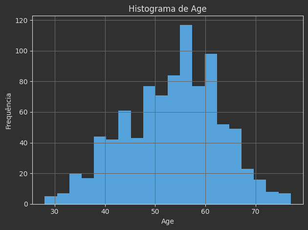
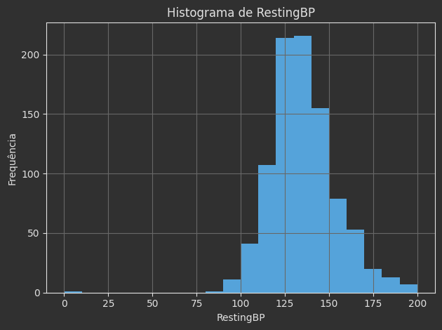
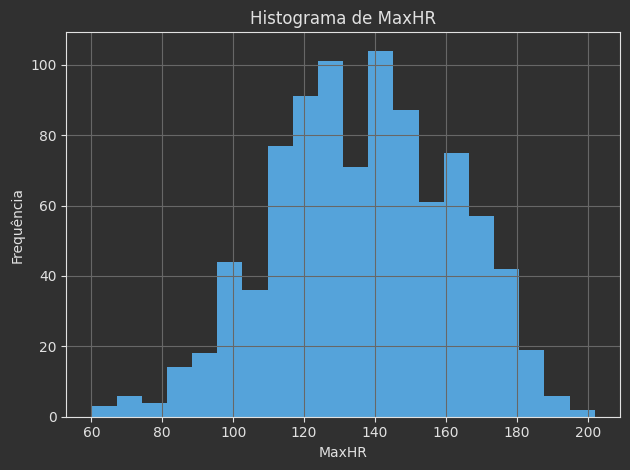
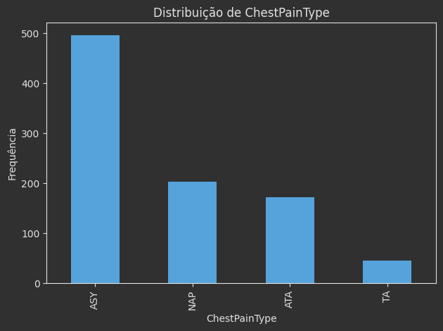
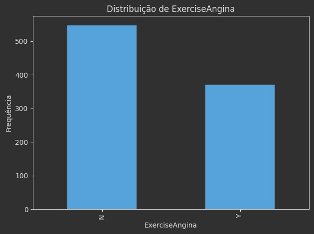
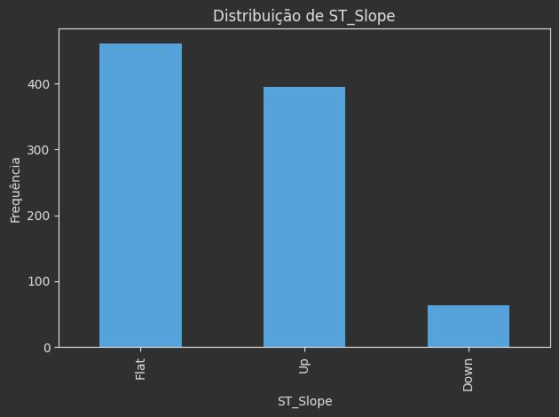

# Índice

1. [Introdução](#1-introdução)
    1. [1.1. Contexto de doenças cardíacas](#11-contexto-de-doenças-cardíacas)
    2. [1.2. Motivação de prever riscos a partir de dados clínicos](#12-motivação-de-prever-riscos-a-partir-de-dados-clínicos)
2. [2. Descrição do Dataset](#2-descrição-do-dataset)
    1. [2.1. Atributo Alvo](#21-atributo-alvo)
    2. [2.2. Tabela com variáveis](#22-tabela-com-variáveis)
3. [3. Análise exploratória](#3-análise-exploratória)
    1. [3.1. Tabelas](#31-tabelas)
    2. [3.2. Gráficos](#32-gráficos)
    3. [3.3. Tabela de valores faltantes](#33-tabela-de-valores-faltantes)
4. [4. Pré-processamento](#4-pré-processamento)
5. [5. Modelagem e avaliação](#5-modelagem-e-avaliação)
6. [6. Resultados e Discussão](#6-resultados-e-discussão)
7. [7. Conclusão](#7-conclusão)

---

# 1. Introdução

## 1.1. Contexto de doenças cardíacas

As doenças cardiovasculares constituem um dos principais problemas de saúde pública, estando entre as principais causas
de morte em diversos países. Em especial, quadros de doença arterial coronariana e insuficiência cardíaca estão
associados a internações frequentes, limitações funcionais e alto custo para os sistemas de saúde.

Na prática clínica, a identificação de pacientes com maior risco de desenvolver ou já apresentar doença cardíaca é feita
a partir de um conjunto de **fatores de risco e achados clínicos**, como idade, sexo, pressão arterial, níveis de
colesterol, presença de alterações eletrocardiográficas, sintomas de dor torácica e alterações durante o esforço físico.
Muitos desses fatores aparecem de forma estruturada em prontuários eletrônicos e exames complementares, criando um
cenário propício para o uso de técnicas de ciência de dados.

Neste trabalho, o foco não é discutir todos os aspectos clínicos das doenças cardíacas, mas sim investigar se
informações **clínicas simples, obtidas rotineiramente**, são suficientes para **alimentar modelos de aprendizado de
máquina** capazes de **distinguir pacientes com e sem doença cardíaca**, usando um conjunto de dados público amplamente
utilizado em estudos de predição.

## 1.2. Motivação de prever riscos a partir de dados clínicos

Com o avanço da informatização em saúde, tornou-se comum registrar de forma digital variáveis como idade, pressão
arterial de repouso, colesterol sérico, resultados de eletrocardiograma, frequência cardíaca máxima em teste de esforço
e presença de sintomas, entre outras. Esses dados estruturados podem ser utilizados para treinar **modelos de
classificação supervisionada** que auxiliem na tomada de decisão clínica.

Modelos desse tipo podem ser aplicados, por exemplo, para:

- Apoiar a **triagem** em serviços de pronto atendimento, destacando pacientes com maior probabilidade de apresentar
  doenças cardíaca;
- Auxiliar na **estratificação de risco**, indicando indivíduos que podem exigir acompanhamento mais próximo;
- Servir como ferramenta de **apoio à decisão**, complementando, e não substituindo, o julgamento do profissional de
  saúde.

Neste trabalho, utilizou-se o **Heart Failure Prediction Dataset**, disponível na plataforma Kaggle, como base para a
construção e comparação de diferentes modelos de classificação. A partir desse conjunto de dados, foram realizadas:

- Uma **análise exploratória** das variáveis disponíveis (Seção 3);
- Etapas de **pré-processamento** e codificação de atributos (Seção 4);
- Treinamento e avaliação de **modelos de classificação supervisionada** com métricas como acurácia, precisão, recall,
  F1 e tempo de treinamento (Seção 5);
- Uma **discussão dos resultados** obtidos, destacando o melhor e o pior desempenho entre os modelos considerados (Seção
  6).

---

# 2. Descrição do Dataset

O conjunto de dados utilizado neste trabalho é o **Heart Failure Prediction Dataset**, disponibilizado por F. Sorianο na
plataforma Kaggle. Ele combina informações clínicas de pacientes provenientes de diferentes bases de dados de doença
cardíaca, resultando em **918 instâncias** e **12 atributos**, sendo 11 atributos preditores e 1 atributo alvo (
`HeartDisease`).

Cada linha do arquivo representa um paciente, e cada coluna corresponde a uma variável clínica ou demográfica, como
idade, sexo, tipo de dor torácica, pressão arterial de repouso, colesterol sérico, presença de glicemia de jejum
elevada, alterações em eletrocardiograma de repouso, frequência cardíaca máxima atingida durante o exercício, presença
de angina induzida por esforço, depressão do segmento ST e inclinação do segmento ST, além do indicador binário de
presença de doença cardíaca.

O dataset está organizado em um único arquivo CSV, no qual não há valores ausentes nas colunas disponíveis, o que
simplifica as etapas iniciais de preparação dos dados. A Seção 3 detalha estatísticas descritivas das variáveis (tabelas
e gráficos), enquanto a Seção 4 descreve o pré-processamento aplicado antes do treinamento dos modelos.

- **Nome do dataset:** *Heart Failure Prediction Dataset*
- **Fonte:** Kaggle – F. Sorianο
- **Link:** https://www.kaggle.com/datasets/fedesoriano/heart-failure-prediction

## 2.1. Atributo Alvo

O atributo alvo deste estudo é `HeartDisease`, disponibilizado no dataset como uma variável **binária**:

- `0` – paciente **sem doença cardíaca**;
- `1` – paciente **com doença cardíaca**.

Do ponto de vista de modelagem, trata-se de um problema de **classificação binária**, em que o objetivo é aprender uma
função que, a partir dos 11 atributos preditores, atribua corretamente cada paciente à classe “com doença” ou “sem
doença”. Na prática, um modelo com bom desempenho nesse contexto pode contribuir para a identificação precoce de
pacientes com maior probabilidade de apresentar doença cardíaca, justificando investigações adicionais ou monitoramento
mais próximo.

Na Seção 5, diferentes algoritmos de classificação serão treinados para prever o valor de `HeartDisease`, e seus
desempenhos serão comparados com base em métricas de avaliação padrão em problemas de classificação.

## 2.2. Tabela com variáveis

A Tabela 1 apresenta os atributos disponíveis no Heart Failure Prediction Dataset, com o respectivo tipo e uma breve
descrição clínica resumida. As interpretações clínicas dessas variáveis serão utilizadas nas etapas de análise
exploratória (Seção 3) e na discussão dos resultados (Seção 6), especialmente para interpretar quais características se
relacionam mais fortemente com a presença de doença cardíaca.

**Tabela 1 – Atributos do Heart Failure Prediction Dataset**

| Nome             | Tipo           | Descrição clínica resumida                                                                                                                      |
|------------------|----------------|-------------------------------------------------------------------------------------------------------------------------------------------------|
| `Age`            | Numérico       | Idade do paciente, em anos. Idades mais avançadas tendem a estar associadas a maior risco cardiovascular.                                       |
| `Sex`            | Categórico     | Sexo biológico do paciente (`M` para masculino, `F` para feminino).                                                                             |
| `ChestPainType`  | Categórico     | Tipo de dor torácica (por exemplo, típica anginosa, atípica, não anginosa, assintomática). Relaciona-se à probabilidade de isquemia miocárdica. |
| `RestingBP`      | Numérico       | Pressão arterial sistólica de repouso, em mmHg. Valores elevados indicam possível hipertensão.                                                  |
| `Cholesterol`    | Numérico       | Colesterol sérico em jejum, em mg/dL. Níveis elevados são fator de risco para aterosclerose.                                                    |
| `FastingBS`      | Numérico (0/1) | Indicador de glicemia de jejum elevada (> 120 mg/dL: `1`; caso contrário: `0`). Relaciona-se a alteração glicêmica/diabetes.                    |
| `RestingECG`     | Categórico     | Resultado do eletrocardiograma de repouso (por exemplo, normal, sobrecarga ventricular, alterações de ST-T).                                    |
| `MaxHR`          | Numérico       | Frequência cardíaca máxima alcançada durante esforço. Valores muito baixos podem sugerir limitação da capacidade funcional.                     |
| `ExerciseAngina` | Categórico     | Presença (`Y`) ou ausência (`N`) de angina induzida por exercício.                                                                              |
| `Oldpeak`        | Numérico       | Depressão do segmento ST induzida por exercício, em relação ao repouso. Associada à isquemia miocárdica.                                        |
| `ST_Slope`       | Categórico     | Inclinação do segmento ST no pico do exercício (ascendente, plana ou descendente), relacionada à gravidade de isquemia.                         |
| `HeartDisease`   | Numérico (0/1) | Indicador de presença (`1`) ou ausência (`0`) de doença cardíaca. **É o atributo alvo do estudo.**                                              |

Essas variáveis serão exploradas quantitativamente na Seção 3, por meio de tabelas e gráficos, e servirão como insumo
para as etapas de pré-processamento (Seção 4) e modelagem (Seção 5), nas quais serão aplicadas técnicas de codificação
de variáveis categóricas e normalização de atributos numéricos antes do treinamento dos modelos de classificação.

---

# 3. Análise exploratória

Nesta seção são apresentadas a caracterização estatística e a distribuição das variáveis do Heart Failure Prediction
Dataset. O objetivo é descrever o perfil dos pacientes e entender o comportamento dos atributos numéricos e categóricos,
preparando o terreno para as etapas de pré-processamento e modelagem.

## 3.1. Tabelas

A Tabela 2 resume as principais estatísticas descritivas dos atributos numéricos do conjunto de dados, incluindo mínimo,
máximo, média, desvio padrão e quartis. Foram consideradas como variáveis numéricas: `Age`, `RestingBP`, `Cholesterol`,
`FastingBS`, `MaxHR` e `Oldpeak`. Essas estatísticas permitem ter uma visão geral das faixas de valores observadas, bem
como da dispersão dos dados em cada atributo.

**Tabela 2 – Estatísticas descritivas dos atributos numéricos do dataset**

| Atributo    | Contagem | Média               | Desvio Padrão      | Mínimo | 1º quartil (25%) | Mediana (50%) | 3º quartil (75%) | Máximo |
|-------------|----------|---------------------|--------------------|--------|------------------|---------------|------------------|--------|
| Age         | 918.0    | 53.510893246187365  | 9.43261650673201   | 28.0   | 47.0             | 54.0          | 60.0             | 77.0   |
| RestingBP   | 918.0    | 132.39651416122004  | 18.5141541199078   | 0.0    | 120.0            | 130.0         | 140.0            | 200.0  |
| Cholesterol | 918.0    | 198.7995642701525   | 109.38414455220348 | 0.0    | 173.25           | 223.0         | 267.0            | 603.0  |
| FastingBS   | 918.0    | 0.23311546840958605 | 0.423045624739303  | 0.0    | 0.0              | 0.0           | 0.0              | 1.0    |
| MaxHR       | 918.0    | 136.80936819172112  | 25.4603341382503   | 60.0   | 120.0            | 138.0         | 156.0            | 202.0  |
| Oldpeak     | 918.0    | 0.8873638344226579  | 1.0665701510493257 | -2.6   | 0.0              | 0.6           | 1.5              | 6.2    |

Além disso, foi elaborado um resumo das variáveis categóricas (`Sex`, `ChestPainType`, `RestingECG`, `ExerciseAngina` e
`ST_Slope`), contendo as frequências absolutas e relativas de cada categoria. Esse resumo é apresentado na Tabela 3. A
partir dessas frequências é possível observar, por exemplo, quais tipos de dor torácica são mais comuns na amostra, qual
a distribuição por sexo e quais padrões de traçado eletrocardiográfico e de inclinação do segmento ST aparecem com maior
frequência.

**Tabela 3 – Frequências absolutas e relativas de cada categoria**

| Atributo         | Categoria | Frequência | Percentual |
|------------------|-----------|------------|------------|
| `Sex`            | M         | 725        | 78.98      |
|                  | F         | 193        | 21.02      |
| `ChestPainType`  | ASY       | 496        | 54.03      |
|                  | NAP       | 203        | 22.11      |
|                  | ATA       | 173        | 18.85      |
|                  | TA        | 46         | 5.01       |
| `RestingECG`     | Normal    | 552        | 60.13      |
|                  | LVH       | 188        | 20.48      | 
|                  | ST        | 178        | 19.39      |
| `ExerciseAngina` | N         | 547        | 59.59      |
|                  | Y         | 371        | 40.41      |
| `ST_Slope`       | Flat      | 460        | 50.11      |
|                  | Up        | 395        | 43.03      |
|                  | Down      | 63         | 6.86       |

Por fim, a Tabela 4 apresenta a distribuição da variável alvo `HeartDisease`, mostrando o número de pacientes sem (`0`)
e com (`1`) doença cardíaca, bem como a proporção de cada classe em relação ao total de 918 instâncias. Essa informação
é importante para avaliar se o problema de classificação é balanceado ou se há predominância de uma das classes, o que
pode impactar a escolha de métricas e modelos na etapa de avaliação.

**Tabela 4 – Distribuição da variável alvo**

| Presença de doença cardíaca | Frequência | Percentual |
|-----------------------------|------------|------------|
| 0                           | 410        | 44.66      |
| 1                           | 508        | 55.34      |

## 3.2. Gráficos

Para complementar as tabelas, foram gerados gráficos que permitem visualizar de forma mais intuitiva a distribuição das
variáveis.

- Para os atributos numéricos `Age`, `RestingBP`, `Cholesterol` e `MaxHR` foram construídos **histogramas**, nos quais o
  eixo horizontal representa faixas de valores e o eixo vertical representa a frequência de pacientes em cada faixa.
  Esses histogramas ajudam a identificar se as distribuições são mais concentradas em determinadas regiões, se há
  assimetrias marcantes ou presença de possíveis outliers.

|               **Gráfico 1 – Histograma `Age`**               |
|:------------------------------------------------------------:|
|                  |
|            **Gráfico 2 – Histograma `RestingBP`**            |
|      |
|           **Gráfico 3 – Histograma `Cholesterol`**           |
|  |
|              **Gráfico 4 – Histograma `MaxHR`**              |
|              |

- Para as variáveis categóricas `Sex`, `ChestPainType`, `ExerciseAngina` e `ST_Slope` foram gerados **gráficos de
  barras**, em que cada barra corresponde a uma categoria e sua altura representa a contagem de pacientes naquela
  categoria. Esses gráficos permitem visualizar rapidamente qual categoria é dominante em cada atributo, de forma
  complementar às frequências mostradas na Tabela 3.

|                   **Gráfico 5 – Gráfico de barras para `Sex`**                   |
|:--------------------------------------------------------------------------------:|
|                        |
|              **Gráfico 6 – Gráfico de barras para `ChestPainType`**              |
|    |
|             **Gráfico 7 – Gráfico de barras para `ExerciseAngina`**              |
|  |
|                **Gráfico 8 – Gráfico de barras para `ST_Slope`**                 |
|              |

- Também foi construído um **gráfico de barras** para a variável alvo `HeartDisease`, destacando o número de pacientes
  com e sem doença cardíaca. Esse gráfico torna evidente o grau de balanceamento entre as duas classes e será utilizado
  como referência nas discussões sobre desempenho dos modelos de classificação na Seção 6.

| **Gráfico 9 – Gráfico de barras para a variável alvo** |
|:------------------------------------------------------:|
|         |

Os gráficos produzidos nesta etapa auxiliam na interpretação das tabelas e fornecem uma visão exploratória inicial das
relações entre as variáveis, ainda que de forma univariada. Relações mais complexas (por exemplo, entre atributos
clínicos e a presença de doença) serão retomadas na discussão dos resultados dos modelos.

## 3.3. Tabela de valores faltantes

Como parte da análise exploratória, foi construída uma tabela específica para verificar a presença de **valores
faltantes** em cada atributo do dataset. A Tabela 5 apresenta, para cada coluna, o número absoluto de valores ausentes e
a porcentagem correspondente em relação ao total de 918 instâncias.

**Tabela 5 – Tabela de valores faltantes**

| Atributo       | Faltantes | Percentual |
|----------------|-----------|------------|
| Age            | 0         | 0.0        |
| Sex            | 0         | 0.0        |
| ChestPainType  | 0         | 0.0        |
| RestingBP      | 0         | 0.0        |
| Cholesterol    | 0         | 0.0        |
| FastingBS      | 0         | 0.0        |
| RestingECG     | 0         | 0.0        |
| MaxHR          | 0         | 0.0        |
| ExerciseAngina | 0         | 0.0        |
| Oldpeak        | 0         | 0.0        |
| ST_Slope       | 0         | 0.0        |
| HeartDisease   | 0         | 0.0        |

A partir dessa análise, verificou-se que o arquivo disponibilizado não contém valores faltantes nas variáveis
consideradas, ou seja, todas as colunas apresentam 0 valores ausentes. Isso simplifica o pré-processamento, pois não há
necessidade de aplicar técnicas de imputação de dados (como preenchimento por média, mediana ou categoria mais
frequente) ou de exclusão de registros por falta de informação.

Ainda assim, a construção dessa tabela é importante para documentar de forma explícita a qualidade dos dados utilizados
e justificar as decisões tomadas nas etapas seguintes. Na Seção 4, parte desse diagnóstico é retomado para explicar por
que não foram adotadas estratégias específicas de tratamento de valores ausentes.

---

# 4. Pré-processamento

- Normalização / padronização dos atributos numéricos (se usar KNN/SVM)
- Codificação de categóricos
    - One-hot encoding para `ChestPainType`, `RestingECG`, `ST_Slope`
    - Codificação binária simples para `Sex`, `ExerciseAngina`
- Justificar cada decisão

---

# 5. Modelagem e avaliação

- Descrever os 3 algoritmos escolhidos
- Explicar como foi feita a divisão treino/teste (ou k-fold)
- Tabelas com:
    - Acurácia, precisão, recall, F1 e tempo de treino por modelo
    - (Opcional) ROC curves / matriz de confusão.

---

# 6. Resultados e Discussão

- Apontar melhor e pior modelo
- Discutir performance por classe (usando `classification_report`)

---

# 7. Conclusão

- Resumir qual modelo seria indicado para uso prático
- Limitações (tamanho da amostra, apenas dados tabulares...)
